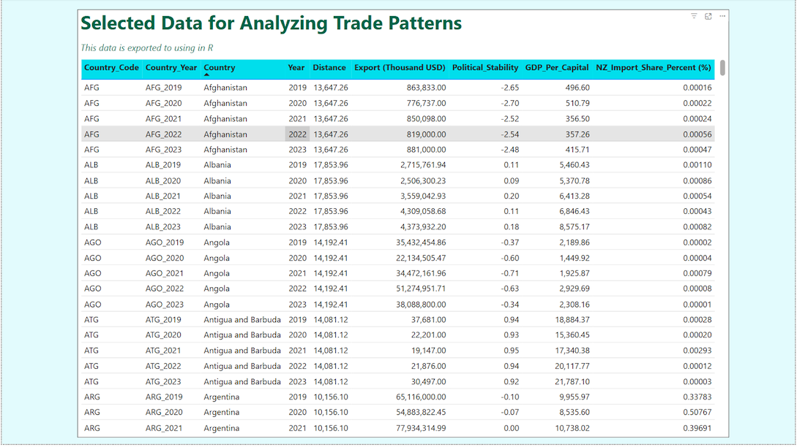
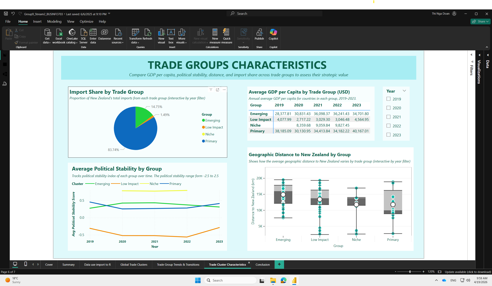

# New Zealand’s Vulnerable International Trade  
Mapping Trade Potential for a More Resilient Supply Chain  

This is a **group project** completed as part of a *Data Visualisation course*, exploring how New Zealand’s international trade structure creates both **strengths and vulnerabilities**.

The analysis covers **5 years (2019–2023)** and **150+ global trade partners**, combining economic, trade, and geopolitical data to understand how New Zealand’s import dependency evolves over time.

## Overview  

To understand how trade operates between New Zealand and its international partners, this project focuses on the **demand side of trade** — specifically, **who New Zealand relies on for imports**.

Data was collected from:
- World Trade Organization (WTO)  
- World Bank  
- Observatory of Economic Complexity (OEC)  

We analyzed trade relationships using four key metrics:

- **Global Export Value** – proxy for a country’s global trade influence  
- **NZ Import Share (%)** – level of dependency on each partner  
- **GDP per Capita** – economic strength and development level  
- **Political Stability & Distance** – contextual factors affecting trade reliability  

After data cleaning and transformation, we applied **unsupervised machine learning (clustering, PCA, anomaly detection)** to group countries with similar trade characteristics.

This was performed **year by year**, allowing us to track how trade relationships evolve and identify shifting vulnerabilities.

## Key Findings  

### 1. Trade partners can be segmented into distinct groups  

Across 150+ countries, trade relationships were grouped into **four clusters** based on shared characteristics:

- **Primary Partners**  
  High import share, strong economies, and stable — e.g., China, Australia, USA  

- **Emerging Partners**  
  Growing economies with increasing trade potential — e.g., Vietnam, Indonesia  

- **Low Impact Partners**  
  Minimal contribution to NZ imports, currently low influence  

- **Niche Partners**  
  Smaller or specialised relationships (often regional or aid-based)  

This segmentation provides a structured way to understand **trade dependency and opportunity**.

### 2. New Zealand is highly dependent on a small group  

- Over **80% of imports consistently come from Primary partners**  
- Key imports include machinery, transport, fuel, and chemicals  

While many of these partners are supported by **Free Trade Agreements**, this level of concentration introduces **systemic risk**:
- Policy changes  
- Supply chain disruptions  
- Geopolitical or environmental shocks  

### 3. Trade relationships are dynamic, not fixed  

- Countries **move between clusters over time**  
- More than **10 countries shifted groups between 2019–2023**  
- Emerging partners show increasing stability and trade relevance  

This indicates that:
> Future key trade partners may already be developing within the system.

### 4. COVID-19 reshaped trade patterns  

- The **Niche group emerged during disruption periods**, separating from Low Impact  
- By **2023, patterns begin stabilising again**  

This suggests a **window of opportunity** to rethink trade strategy before patterns fully lock in.

## Strategy Implications  

### 1. Diversification is no longer optional  

Heavy reliance on a few partners creates vulnerability.  
New Zealand should actively **diversify its import base** to reduce systemic risk.

### 2. Emerging partners are the key opportunity  

Countries such as:
- Vietnam  
- Indonesia  
- Philippines  

Already have:
- Trade agreements (ASEAN, EU–NZ)  
- Improving political stability  
- Competitive geographic positioning  

These markets represent **scalable and realistic alternatives**.

### 3. Data-driven clustering supports strategic planning  

Segmenting trade partners provides a **decision framework** for:
- Trade prioritisation  
- Policy negotiation  
- Supply chain resilience planning  

## Screenshots  

### Report Overview  

### Data Preparation & Export  

### Trade Clusters (Global View)  

### Trade Group Trends  

### Trade Group Characteristics  

### Data Model  

### Conclusion  

## Important Note  

The screenshots in this repository are static and may not capture all available interactions or detailed views from the Power BI dashboard.  

To explore the full interactive report, download the `.pbix` file below:

👉 [Download Power BI Dashboard](./nz-trade-resilience-dashboard.pbix)

## My Role and Contribution  

- Designed and developed the **full Power BI dashboard**, including layout, visuals, and storytelling  
- Performed **data transformation and preparation** across multiple datasets  
- Conducted **Exploratory Data Analysis (EDA)** to identify key patterns and relationships  
- Built the **data model in Power BI**, integrating multiple data sources into a structured schema  
- Implemented **DAX measures** for key metrics and analytical calculations  
- Performed **data analysis in R**, including:
  - Clustering (k-means)  
  - Principal Component Analysis (PCA)  
  - Anomaly detection  

## Tools and Technologies  

- Power BI (Data modelling, DAX, dashboard design)  
- R (Clustering, PCA, data analysis)  
- Excel / CSV (data preparation)  
