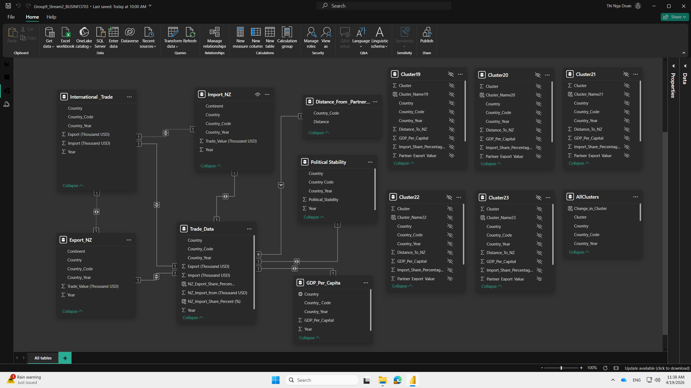
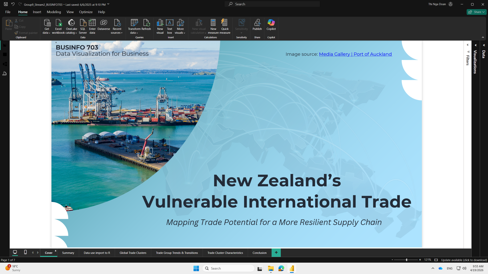
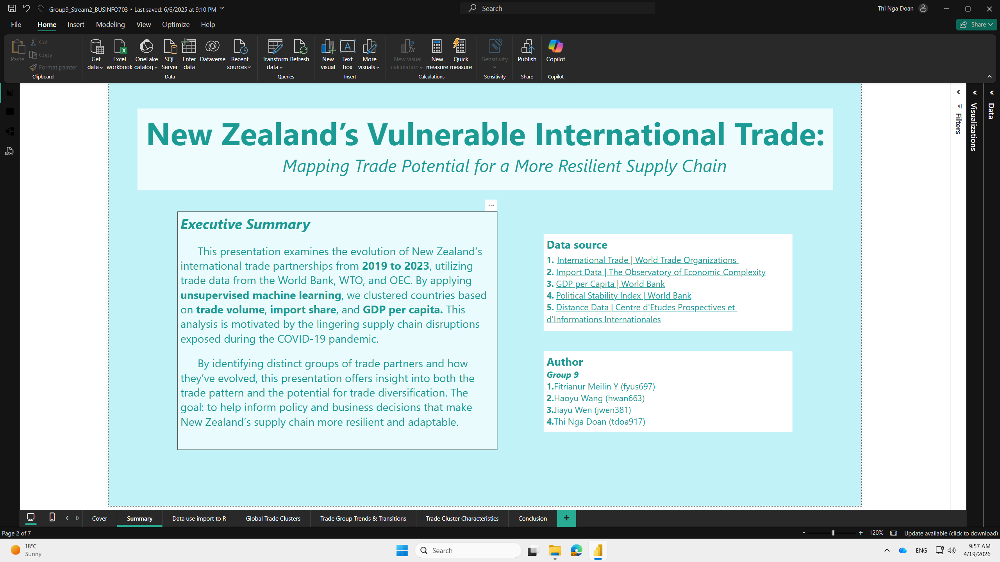
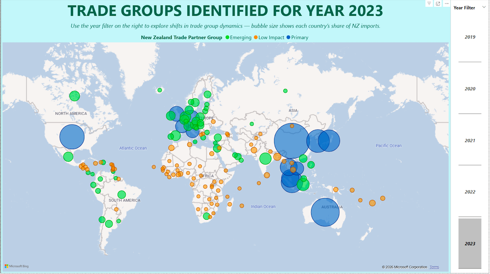
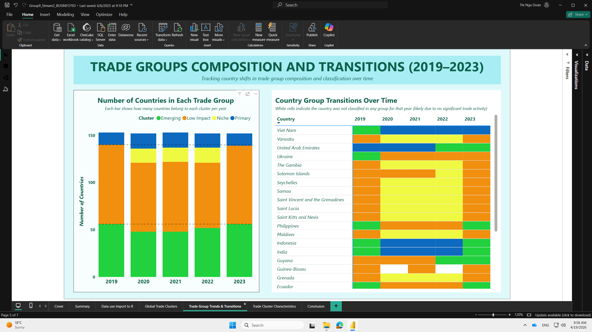
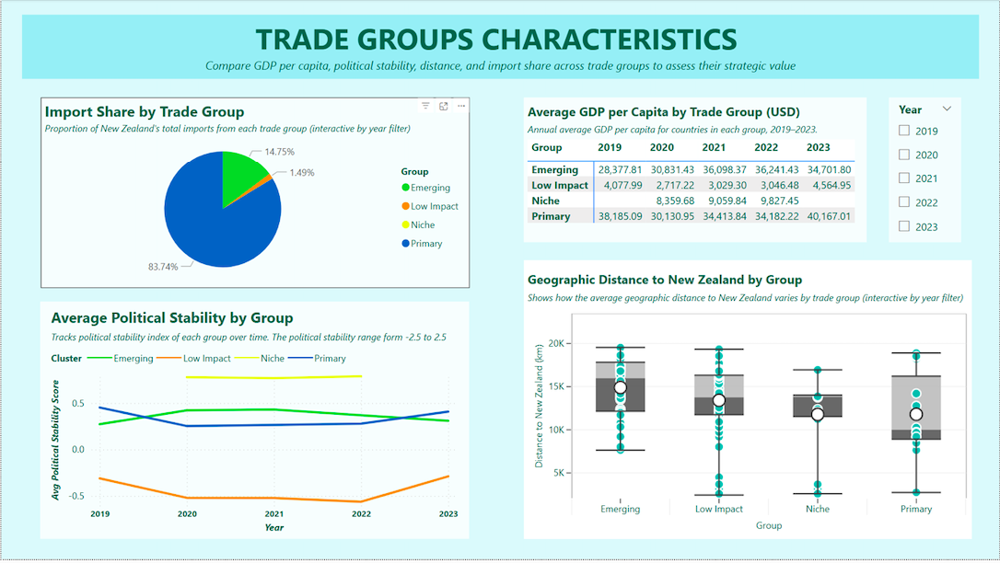
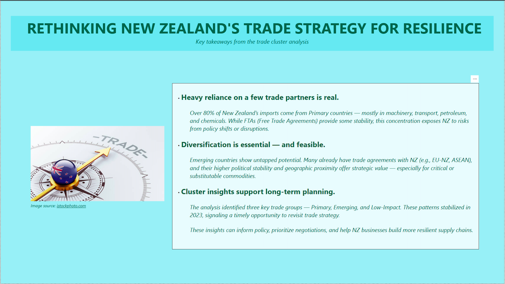

# New Zealand Trade Resilience Analysis

An end-to-end analysis of New Zealand’s trade vulnerability using clustering and data modelling to identify diversification opportunities across 150+ global trade partners (Power BI, R, DAX).

## Overview

This project analyzes New Zealand’s international trade relationships over a 5-year period (2019–2023), covering more than 150 global trade partners.

The primary objective is to assess New Zealand’s trade vulnerability from a demand-side perspective — focusing on who New Zealand depends on for imports, and how those dependencies evolve over time.

This work was completed as part of a group project in a Data Visualisation course, with a focus on combining data analysis, machine learning, and business-oriented reporting.

Data was collected from the World Trade Organization (WTO), World Bank, and the Observatory of Economic Complexity (OEC). The analysis focuses on three core metrics:

- **Global export value** – a proxy for each country’s influence in the global supply chain  
- **New Zealand import share (%)** – measuring how dependent New Zealand is on each partner  
- **GDP per capita** – reflecting economic strength and development level  

To provide a more complete view of trade relationships, additional factors such as **political stability** and **geographic distance** were incorporated.

After cleaning and transforming the data, unsupervised machine learning techniques were applied to group countries based on similar trade characteristics. This clustering was performed year by year to track how trade relationships evolved over time.

## Key findings

### 1. Trade partners can be segmented into four distinct groups

The analysis groups New Zealand’s trade partners into four clusters based on their combined trade, economic, and geographic characteristics:

- **Primary partners**  
  Major economies such as Australia, China, and the United States. These countries have high trade volume, large import share, strong economic capacity, and relatively stable conditions.  

- **Emerging partners**  
  Developing and mid-tier economies such as Vietnam, Indonesia, and Poland. These countries show moderate trade engagement but strong growth potential.  

- **Low-impact partners**  
  Countries with minimal trade contribution to New Zealand. While numerous, they currently play a limited role in the overall supply chain.  

- **Niche partners**  
  Smaller economies, often island nations or aid-based relationships. Although trade volume is low, they may have regional or strategic importance.  

During the COVID-19 period, a subset of countries began to behave differently from the broader Low-impact group, leading to the emergence of a distinct Niche category.

This segmentation provides a structured way to understand trade relationships beyond simple rankings, capturing both risk and opportunity.

### 2. New Zealand’s trade is highly concentrated

Over 80% of New Zealand’s imports consistently come from the **Primary group**, indicating strong dependence on a small number of partners.

These imports are concentrated in critical sectors such as machinery, transportation, energy, and chemicals. While many of these relationships are supported by Free Trade Agreements, this level of concentration increases exposure to external risks such as supply disruptions, policy changes, and global shocks.

### 3. Emerging partners offer diversification potential

The **Emerging group** represents the most practical opportunity for diversification.

These countries often demonstrate:
- increasing trade engagement  
- relatively stable political environments  
- closer geographic proximity compared to traditional partners  

Examples include ASEAN countries such as Vietnam, Indonesia, and the Philippines, as well as underutilised partners within existing agreements such as the EU–NZ framework.

Despite these advantages, their share of New Zealand’s imports remains relatively low, indicating that diversification potential is not yet fully leveraged.

### 4. Trade relationships are dynamic over time

Although the overall structure of trade groups remains relatively stable from 2019 to 2023, individual countries move between clusters over time.

More than 10 countries were observed to shift groups, particularly within the Emerging category. These movements reflect changes in economic conditions, trade activity, and strategic importance.

This highlights that trade relationships are not fixed, and that future key partners may already be emerging.

### 5. Trade relationships are multi-dimensional

The analysis shows that trade importance cannot be explained by volume alone.

Instead, it is shaped by a combination of:
- economic strength  
- political stability  
- geographic distance  
- and existing trade intensity  

This reinforces the need for a multi-dimensional approach when evaluating trade partners and designing long-term strategies.

## Strategic implication

New Zealand’s current trade structure is efficient but exposed.

Heavy reliance on a small group of Primary partners creates vulnerability, even when those relationships are stable. At the same time, Emerging partners present clear and underutilised opportunities for diversification.

By gradually expanding engagement with Emerging countries — particularly those with existing trade agreements, strong stability, and favourable geographic positioning — New Zealand can reduce dependency risk and improve long-term supply chain resilience.

The clustering framework developed in this project provides a practical foundation for identifying, prioritising, and monitoring trade partners in a more structured and forward-looking way.

## Data pipeline and methodology

1. Collected and integrated data from multiple sources (WTO, World Bank, OEC)  
2. Performed exploratory data analysis (EDA) to understand distributions and relationships  
3. Cleaned and transformed datasets across 150+ countries and 5 years (2019–2023)  
4. Applied unsupervised machine learning techniques in R (clustering, PCA, anomaly detection)  
5. Re-integrated modelling outputs into Power BI  
6. Built a relational data model and created DAX measures for interactive reporting  

## Data model

The data model integrates multiple datasets across country and year dimensions to support a unified analysis of New Zealand’s international trade.

A central fact table (`Trade_Data`) combines key trade metrics such as export value, import value, and New Zealand’s import share. This table connects to supporting datasets using `Country_Code` and `Country_Year`.

Additional datasets include:
- GDP per capita (economic context)  
- political stability (geopolitical risk)  
- distance from New Zealand (geographic constraints)  

Clustering outputs generated in R were re-integrated into Power BI, enabling dynamic segmentation and time-based analysis.

## My role and contribution

This project was completed as part of a group assignment, where I focused on the end-to-end data and analytics workflow:

- performed exploratory data analysis (EDA) to understand data distributions and relationships  
- performed data transformation and preparation across multiple datasets covering 150+ trade partners over 5 years (2019–2023)  
- conducted data analysis and implemented unsupervised machine learning in R (clustering, PCA, anomaly detection)  
- built the data model in Power BI, including relationships and DAX measures  
- designed and developed the full Power BI report, including layout, visuals, and storytelling  

This role allowed me to connect data processing, machine learning, and visualization into a cohesive analytical workflow.

## Dashboard preview

## Tools used

- Power BI  
- DAX  
- R  
- tidyverse  
- ggplot2  
- cluster  
- plotly  

## Important note

The screenshots in this repository are static and may not capture all available interactions or detailed views from the Power BI dashboard.

To fully explore the report, download and open the Power BI file:

👉 [Download Power BI Dashboard](./nz-trade-resilience-dashboard.pbix)
